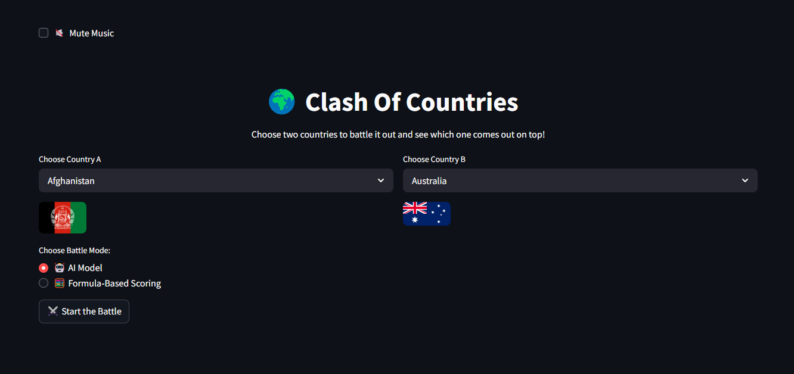
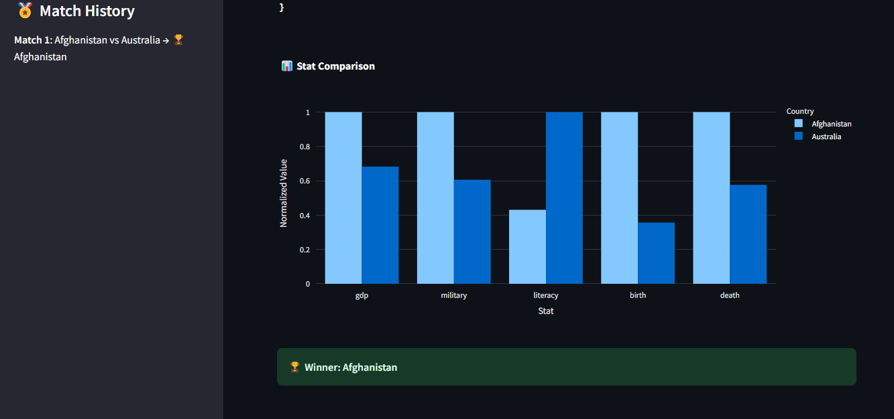

# 🌍 Clash of Countries — AI vs. Stats Battle App

Welcome to **Clash of Countries** — an AI-powered battle simulator where nations go head-to-head based on real-world statistics like GDP, military, literacy, birth, and death rates. Choose your champions and watch them fight it out with animations, sound, and data!

---

## 🎯 Features

- 🤖 **AI Mode** — Machine Learning model predicts the winner
- 🧮 **Formula Mode** — Battle scored with weighted stats
- 📊 **Stat Comparison** — Normalized bar chart visualization
- 🧠 **Balanced Logic** — No more GDP-only wins!
- 🌎 **Country Flags** — Automatically displayed with ISO support
- 🎵 **8-bit Background Music** — With mute/unmute toggle
- 🔊 **Sound Effects** — Countdown and victory effects for immersion
- 🏅 **Match History** — Tracks previous battles in the sidebar
- 🎬 **Battle Countdown + Animation** — Dramatic lead-in to results
- 🎉 **Result Sound & Celebration** — Winner announcement with balloons

---

## 🚀 Getting Started

### ✅ Prerequisites

Make sure you have:

- Python 3.8+
- Pip installed
- These Python libraries:
  ```
  streamlit pandas numpy scikit-learn joblib plotly pillow requests pycountry
  ```

Install them with:

```bash
pip install -r requirements.txt
```

> Or manually install:
```bash
pip install streamlit pandas numpy scikit-learn joblib plotly pillow requests pycountry
```

---

### 📁 Files Included

| File                                       | Purpose                                    |
|-------------------------------------------|--------------------------------------------|
| `app.py`                                  | Main Streamlit app                         |
| `battle_model.pkl`                        | Trained RandomForestClassifier model       |
| `battle_scaler.pkl`                       | Scaler for input features                  |
| `battle_ready_countries_final.csv`        | Cleaned dataset for battles                |
| `music/8-bit-loop-189494.mp3`             | Background music loop                      |
| `music/three-two-one-fight-deep-voice.mp3`| Countdown sound effect                     |
| `music/success-1-6297.mp3`                | Winner announcement sound                  |

---

### 🏃‍♂️ Run the App

```bash
streamlit run app.py
```

The app will open in your browser. Choose two countries and press **⚔️ Start the Battle**.

---

## 🧠 How It Works

### 🔄 Dual Mode:

- **AI Model:** Uses a trained classifier based on stat differences
- **Formula-Based:** Calculates scores with this formula:

```
Final Score = 
  30% GDP +
  25% Military +
  20% Literacy +
  15% Birth Rate +
  10% Inverted Death Rate
```

---

## 📦 Dataset

`battle_ready_countries_final.csv` includes cleaned and numeric data for:
- GDP (in dollars)
- Military (% of GDP)
- Literacy (%)
- Birth Rate (per 1,000)
- Death Rate (per 1,000)

Stats were manually validated and normalized.

---

## 📷 Screenshots

> *Main Menu*  
> 

> *Result*  
> 

---

## 👨‍💻 Author

**Shaheryar Ali**  
`github.com/lucixsherry06`  
Feel free to fork, star ⭐, or submit pull requests!

---

## 📜 License

MIT License — free to use, modify, or contribute.
